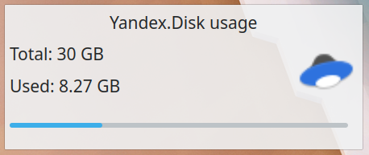
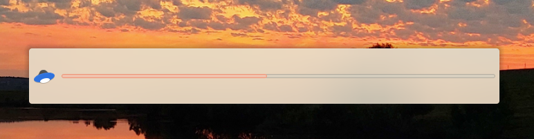

# Plasma Yandex.Disk Info #

## Russian ##

Простой плазмоид для Яндекс.Диск.

Этот плазмоид отображает общее и использованное место вашего аккаунта в Яндекс.Диск.

Он просто запускает "yandex-disk status" каждые пять минут и парсит вывод.

### Установка ###

#### Из исходного кода ####

На Ubuntu 20.04+ и подобных дистрибутивах:

1. Склонировать репозиторий
2. apt install cmake extra-cmake-modules libkf5plasma-dev plasma-framework pkg-kde-tools
3. mkdir -p build && cd build
3. cmake .. -DCMAKE_INSTALL_PREFIX=/usr -DCMAKE_BUILD_TYPE=Release
4. make && make install

#### Из PPA на Ubuntu ####

1. sudo add-apt-repository ppa:bulvinkl/ppa
2. sudo apt update
3. sudo apt install plasmoid-ydinfo

#### Из store.kde.org ####

Плазмоид так же доступен в каталоге дополнений KDE по ссылке: https://store.kde.org/p/1884528

## English ##

Simple Plasma Applet for Yandex.Disk.

This applet show info about used and total space of your Yandex.Disk account.

It just run "yandex-disk status" every five minutes and parse output.

### Installation ###

#### From source code ####

On Ubuntu 20.04+ and derivatives:

1. Clone this repository
2. apt install cmake extra-cmake-modules libkf5plasma-dev plasma-framework pkg-kde-tools
3. mkdir -p build && cd build
3. cmake .. -DCMAKE_INSTALL_PREFIX=/usr -DCMAKE_BUILD_TYPE=Release
4. make && make install

#### From Ubuntu PPA ####

1. sudo add-apt-repository ppa:bulvinkl/ppa
2. sudo apt update
3. sudo apt install plasmoid-ydinfo

#### From store.kde.org ####

This plasmoid also available in KDE Store: https://store.kde.org/p/1884528
